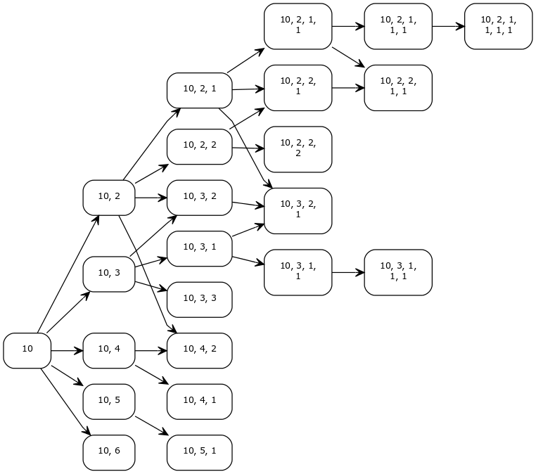

# Esimerkki alkukortilla 10

10 on yksinkertaisin käsiteltävä alkukortti (helpoin piirtää).

Alla on kaavio, joka esittää ohjelman etenemistä vaiheittain. Todellisuudessa ohjelma ei erittele käsittelyä vaiheisiin, vaan käsittelee solmuja yksi kerrallaan lisäysjärjestyksessä (ylhäältä alas, sarake kerrallaan.)

Kaaviosta on vaikea nähdä kaikkia nuolia. Alla on sama kaavio ilman päätössolmuja (17, 18, 19, 20 ,21, BJ, bust).

Huomaa, että monta solmua voi edetä samaan solmuun. Tämä solmujen yhdistyminen on algoritmin etu rekursiiviseen toteutukseen verrattuna. Solmujen yhdistyminen rajoittaa solmujen määrän eksponentiaalista kasvua, mikä on erityisen tärkeää vaikeammilla aloituskorteilla, kuten 1 tai 2.
