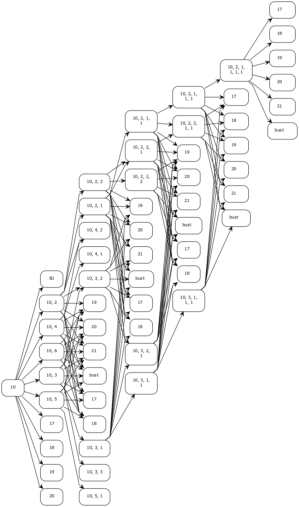

# Esimerkki alkukortilla 10

10 on yksinkertaisin käsiteltävä alkukortti (helpoin piirtää).

Alla on kaavio, joka esittää ohjelman etenemistä vaiheittain. Jokaisella solmulla on 10 lasta, jos se ei ole päätössolmu (17, 18, 19, 20 ,21, BJ, bust), koska pakasta voidaan nostaa 10 erilaista korttia. Monet lapset voivat olla sama päätössolmu (bust), näistä on merkitty vain yksi.

Kaaviosta on vaikea nähdä kaikkia nuolia. Alla on sama kaavio ilman päätössolmuja.

Todellisuudessa ohjelma ei erittele käsittelyä vaiheisiin, vaan käsittelee solmuja yksi kerrallaan lisäysjärjestyksessä (ylhäältä alas, vasemmalta oikealle).
Huomaa, että monta solmua voi edetä samaan solmuun. Tämä solmujen yhdistyminen on algoritmin etu rekursiiviseen toteutukseen verrattuna. Solmujen yhdistyminen rajoittaa solmujen määrän eksponentiaalista kasvua, mikä on erityisen tärkeää vaikeammilla aloituskorteilla, kuten 1 tai 2.
